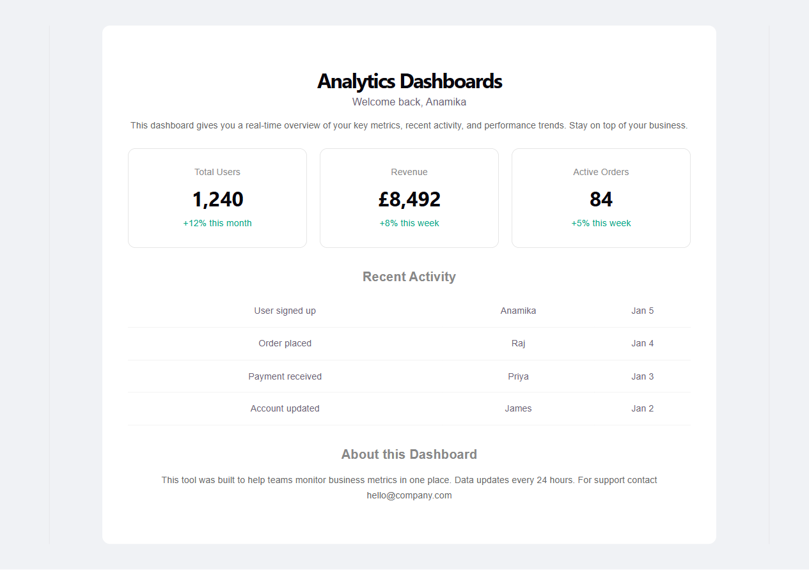
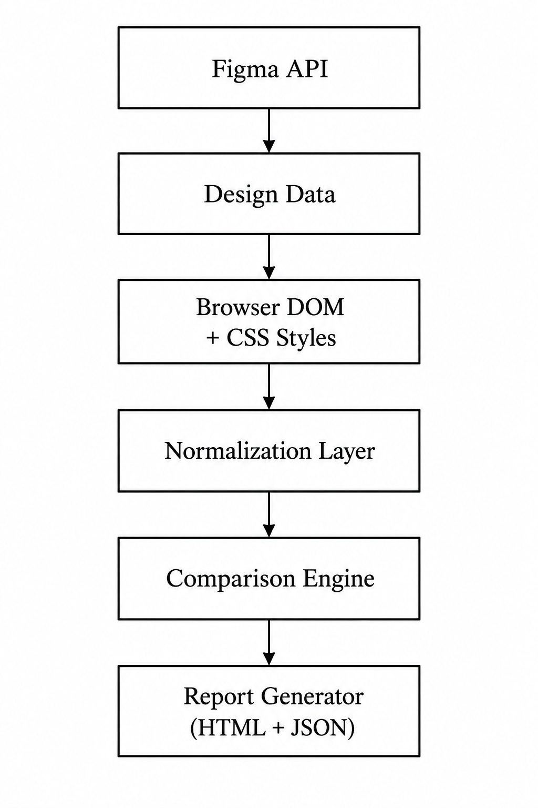

# Figma-UI-comparison-tool
Automated comparison of Figma designs vs actual website UI.

## Overview
A project demonstrating automated comparison between Figma design files and implemented website UI.  
It highlights mismatches in styles, layout, and components to ensure design fidelity.

## Features
- Extracts design data from Figma.
- Captures live browser DOM and styles.
- Normalizes datasets for comparison.
- Generates visual HTML reports with flagged mismatches.
- Provides JSON output for analysis.

## Tech Stack
- Node.js
- Playwright
- Figma API
- JavaScript / HTML / CSS

## Workflow
1. Fetch design data from Figma.
2. Extract DOM + CSS from the target website.
3. Normalize both datasets.
4. Compare and flag mismatches.
5. Generate a report (HTML + JSON).

## Demo Screenshots

## Architecture

## Outcome
- Reduced manual QA effort.
- Improved collaboration between design and development teams.
- Delivered clear, explainable mismatch reports.

